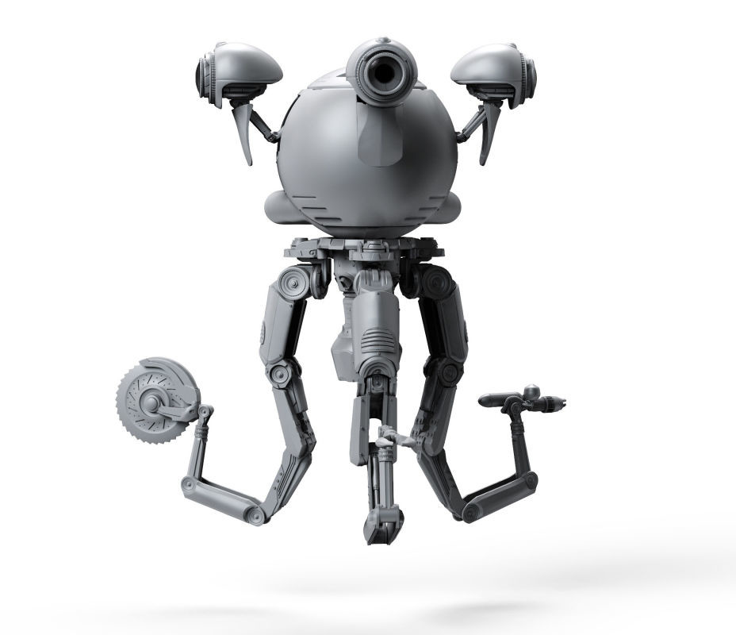
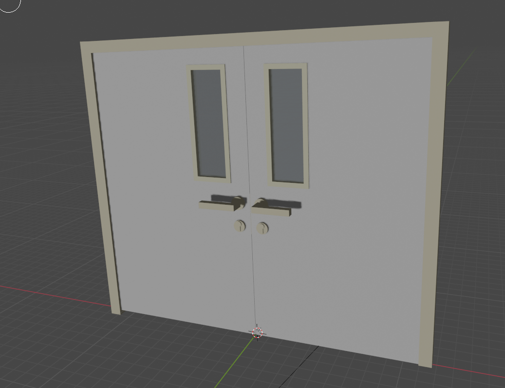

# Location and setting:

- Hospital, located somewhere in hills with could weather. Almost isolated from the outside world. 
- The hospital is crawling with service robots. All of them try to kill the protagonist

# Gameplay

The gameplay is stealth horror with a little of shooting elements:  
### Movement
- Posiibilities
    - The character walks with slow speed, but can run.
    - The character can dash (this should be tested)
    - The character can crouch (he decreases to 0.25 of his original size and makes no noise when crouched)
- When the character walks - he is heard on small distance
- When the character runs - he is heard on medium distance
- When the character is croucheed - he does NOT make noise

### Shooting:
- The player will only have a pistol that is always lacking bullets. The gun can barely shoot a robot so stealth is highly encouraged. Bullets are scarce. No tactic reload (unused bullets are wasted switching magazines). Reload takes roughly 3 seconds.  
- Bullets can be found on on defeated **guards** (1 bullet) and very rarely on locations in closets and cabinets. 
- The pistol magazine capacity is 6 bullets.

### Recharge:
- Performed using the **R** key
- No tactical recharge    

### Enemies: 
There will be two types of enemies:  
- **Nurce (Reference until a similar 3D model is made):**

    - **Behaviour:**
        - **Patrolling:** May patrool a small tetritory but usually "stands" still.
        Blind by itself, but can see through the cameras which the hospital lots of. Can also hear the player walking and mooving objects around on small distances. If player starts running - it can hear him on middle distances.  
        - **Concerned:** Marks the point where the sond was heared and patrooling around that area for 15 seconds. If the player does make noise again - it starts to attack the player. Goes back to **patrooling** state (to the area it was patrooling before had got concerned) if the player makes no noise and doesn't get spotted by cameras after expiring of those 15 seconds.  
        - **Attack:**  If it detects the player - the hear distance increases even more. It goes to the player and immediatelly kills him shocking with electricity. If the player is turned away from it - it wrings his neck by turning the character's head to it's face (not electro-shocking the player). The kill is followed by a jumscare in both cases. From this point the only player's way to defeat if is to kill with his pistol.

    - Can be killed from pistol in two shoots
    - Has roughly the same speed when patrooling/concerned and superior speed when attacking.

- **Guard (Reference until a similar 3D model is made):**
     

    - **Behaviour:**
        - **Patrolling:** Either patrools a specific area/line, rarely stands still. Can both see (only by itself, not through cameras) and hear player on the same level as **nurse**, If a **nurse** detects the player - **guard** gets player's position too. After either via **nurse** or by hearing or if it sees the player for 0.5 second - it becomes **concerned**.
        - **Concerned:** Checks the area around the suspicious position. Sharpness of hearing stays the same. If it sees the player for 1 more second - the robot starts **attacking**. If the player jhn   
        - **Attack:** Shoots the player from it's machine guns on high distance (machine guns have the firerate roghly like ak-47 in automatic mode). The damege is such that if the player stands still - he gets killed in 3 seconds. Can either be killed by player or outrun. Gets back **concerned** if can neither see nor hear the player for 7 seconds
    - Can be killed from pistol in 4 shots.
    - When patrooling has a little slower speed than **nurse when patrooling**. When concerned speeds up a little. When **attacking** speeds up even more so it a little slower speed than player running (but the player can still outrun it).

### Doors:  
There will be two types of doors:
- Clinic doors:

| Double | Single |
|:----|:----|
|  |  |

Open as you go through them and close physycally. Can be opened to both sides. Silent to open and close - don't provoke enemies.

- Solid Doors:   

| Double | Single |
|:----|:----|
|  |  |

Open when you interract with them. Only open to one side, DOES make noise on small distance when the player opnens them.
- Doors can be locked completely or with a key. When the player tries to open a locked door - special sound plays (the sound is heard by robots on small distance).

### Health:
- Mental and Physycal health are united.

- The character has 1.0 HP (0.0 - 0%, 1.0 - 100%, 0.5 - 50%)

- HP decreaces when the character:
    - When near strubbing lights
    - When damaged by **guard**
    - When gets cold
    - When gets attacked by **nurse** (deals 1,0 damage)

- HP increaces when the character:
    - When under violate light (usually located in dangerous places, recovers all health, but slowly)
    - When uses a medkit (immediatelly recovers 0.25 HP, can be very rarely found in the location and on the "corpse" of a **nurse**)

### Interraction:

- The player can come up to an interractable obect and press the interraction button (F/E) and the interaction will perform.

- Possible interractions:
    - Open/close a sold door 
    - Pick a small object (example: box) (when not standing on it)
    - Use a medkit (gets used immediatelly without picking it up; Wont be used if health is 1.0)
    - Switch off/on a light

?? - *implementation needs to be dicused* 

?? : - *there are some ideas*